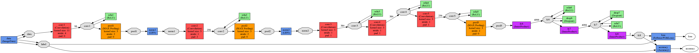

## Test Data
In order to obtain the data for training/testing purposes, I helped
myself with ImageNet webpage. The page contains of enormous number
of images, sorted according to tags. Using tags *triangle* and
*circle* I was able to put my hands on the URLs lists and utilizing
simple python script enabled me to download the images and dispose
any that was damaged. There are:
* 153 triangle pictures
* 564 circle pictures

Although there is almost 4 times more pictures of circles I was courious
how the network will response to such disproportion and how it effects
the final classifier, hence I proceeded.

Following table presents the ratio between testing and training sets
in both, circle and triangles images. The rproportion is 9:1 or in other
words: 90% of images in triangles/circles set was used for training and
10% for testing.
<table>
<tr>
    <td></td>
    <td>Training</td>
    <td>Testing</td>
</tr>
<tr>
    <td>Triangle</td>
    <td>137</td>
    <td>16</td>
</tr>
<tr>
    <td>Circle</td>
    <td>507</td>
    <td>57</td>
</tr>
</table>

## Network Design
Since the task purpose was to understand the basics of Caffe framework
and the thesis involvement in designing convolutional neural networks
is rather small, I assumed that it would be ok to use an existing
model of layers. The model is BAIR/BVLC CaffeNet Model with a slight
modification in fully connected *fc8* - instead of 100 classes, 2 were
set. Following image depicts the network layers setup. It has been
produced with *draw_net.py* script shipped with Caffe.

(Chrome) Please right click on the image and select 'Open image in new
tab'. Then, by clicking on magnifying glass one can inspect fully sized
image.

## Results
Set of results for images depicting triangles that should be obvious for
the classifier to classify. Any change in perspective with a triangle
image results in dramatic change in performance. It is most probably
caused by low number of triangle images provided for training the
classifier and not so many examples with strange camera angles.
<table>
<tr>
    <th>Image</th>
    <td></td>
    <td></td>
    <td></td>
    <td></td>
</tr>

<tr>
    <th>Triangle</th>
    <td>0.9980729</td>
    <td>0.0000309</td>
    <td>0.9998710</td>
    <td>0.6579151</td>
</tr>

<tr>
    <th>Circle</th>
    <td>0.0019271</td>
    <td>0.9999691</td>
    <td>0.0001289</td>
    <td>0.3420849</td>
</tr>
</table>

<table>
<tr>
    <th>Image</th>
    <td></td>
    <td></td>
    <td></td>
    <td></td>
</tr>

<tr>
    <th>Triangle</th>
    <td>0.9999931</td>
    <td>0.9999542</td>
    <td>0.2439452</td>
    <td>0.9409665</td>
</tr>

<tr>
    <th>Circle</th>
    <td>0.0000069</td>
    <td>0.0000458</td>
    <td>0.7560548</td>
    <td>0.0590335</td>
</tr>
</table>

Set of results for images depicting circles that should be obvious for
the classifier to classify. Network handles the task well.

<table>
<tr>
    <th>Image</th>
    <td></td>
    <td></td>
    <td></td>
    <td></td>
</tr>

<tr>
    <th>Triangle</th>
    <td>0.0000078</td>
    <td>0.0001376</td>
    <td>0.0854333</td>
    <td>0.0000162</td>
</tr>

<tr>
    <th>Circle</th>
    <td>0.9999921</td>
    <td>0.9998624</td>
    <td>0.9145667</td>
    <td>0.9999838</td>
</tr>
</table>

<table>
<tr>
    <th>Image</th>
    <td></td>
    <td></td>
    <td></td>
    <td></td>
</tr>

<tr>
    <th>Triangle</th>
    <td>0.4076157</td>
    <td>0.0000519</td>
    <td>0.0000001</td>
    <td>0.0000024</td>
</tr>

<tr>
    <th>Circle</th>
    <td>0.5923843</td>
    <td>0.9999480</td>
    <td>0.9966859</td>
    <td>0.9999999</td>
</tr>
</table>

Set of results for images containing oval and triangulish shapes. I
was wondering how the classifier will react to those mixed pictures.
As it occurs, the network seems to be more into circles, unless shape
of a triangle is an obvious, plane case without any unusual perspective.
It may come from a fact that in training/testing set, the triangles
were underrepresented and treated only simple cases.
<table>
<tr>
    <th>Image</th>
    <td></td>
    <td></td>
    <td></td>
    <td></td>
</tr>

<tr>
    <th>Triangle</th>
    <td>0.0006555</td>
    <td>0.4060124</td>
    <td>0.0000001</td>
    <td>1.0000000</td>
</tr>
<tr>
    <th>Circle</th>
    <td>0.9993445</td>
    <td>0.5939876</td>
    <td>0.9999999</td>
    <td>0.0000000</td>
</tr>
</table>

<table>
<tr>
    <th>Image</th>
    <td></td>
    <td></td>
    <td></td>
    <td></td>
</tr>
<tr>
    <th>Triangle</th>
    <td>0.0016108</td>
    <td>0.0216434</td>
    <td>0.0002671</td>
    <td>0.0294803</td>
</tr>
<tr>
    <th>Circle</th>
    <td>0.9983892</td>
    <td>0.9783567</td>
    <td>0.9997329</td>
    <td>0.9705198</td>
</tr>
</table>